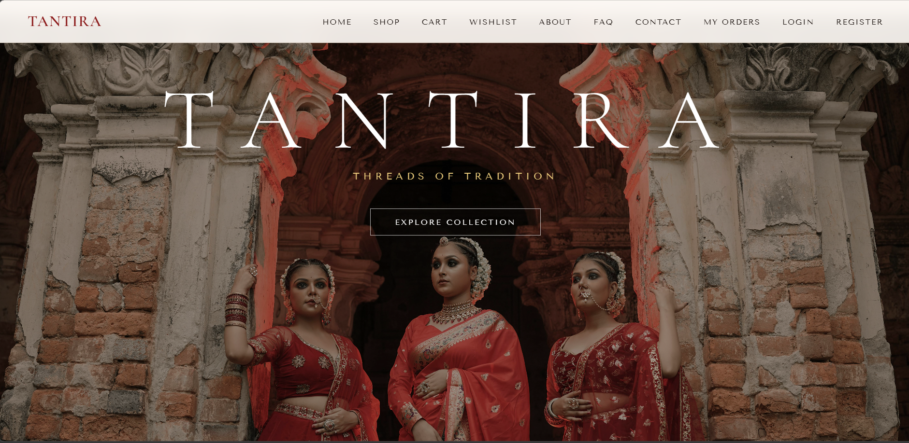
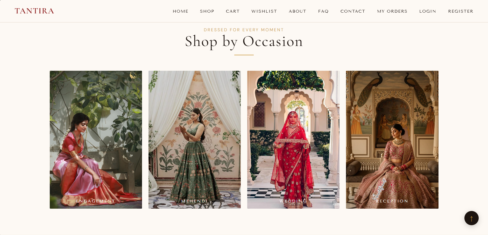
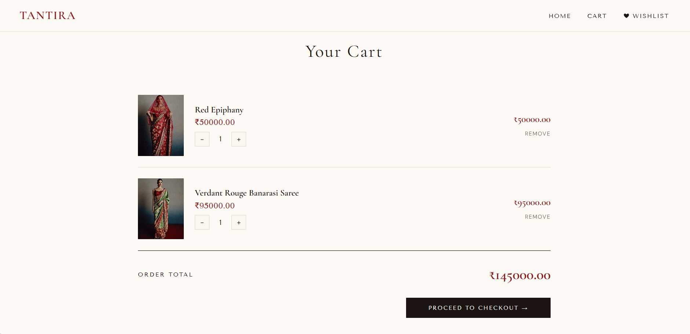
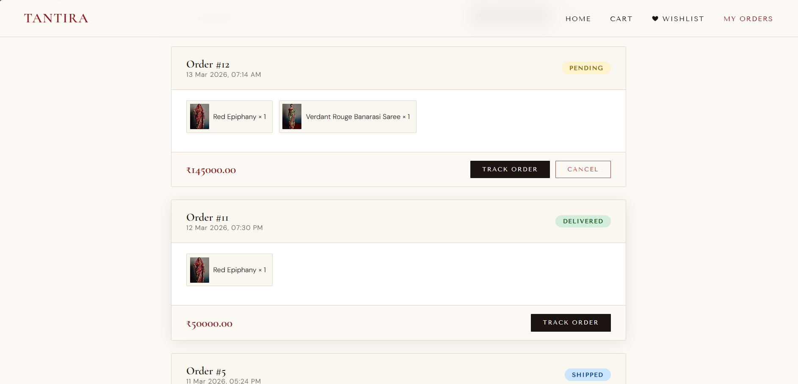
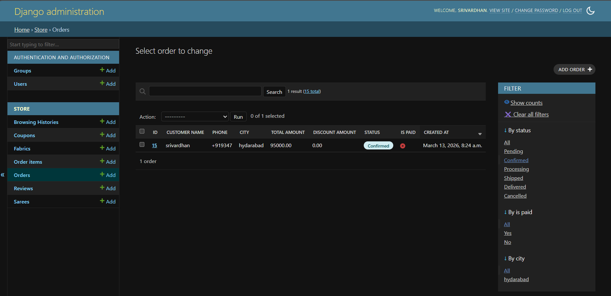

# 🪡 Tantira — Luxury Indian Fashion E-Commerce

> *Threads of Tradition, Woven with Love.*

A full-stack e-commerce web application for luxury Indian ethnic wear — Sarees, Lehengas, and more. Built with Django and designed with an editorial luxury aesthetic inspired by Indian bridal fashion.

---

## ✨ Live Preview

> Run locally at `http://127.0.0.1:8000`

---

## 🖼️ Screenshots

| Home | Products | Product Detail |
|------|----------|----------------|
|  |  |  |

| Cart | Orders | Dashboard |
|------|--------|-----------|
|  |  |  |

---

## 🚀 Features

### 🛍️ Shopping
- Browse Sarees, Lehengas, Salwar Kameez, Kurtis & Anarkalis
- Filter by **Category** and **Occasion** (Wedding, Engagement, Mehendi, Reception)
- Search by name, fabric, color, description
- Sort by price, rating, newest
- Product detail with up to **4 images** + thumbnail switcher
- Add to **Cart** and **Wishlist**
- Related products based on browsing history

### 🛒 Cart & Checkout
- Session-based cart (works without login)
- **Coupon code** support with discount
- Multi-step checkout with address form
- Payment options — Cash on Delivery + Razorpay (UPI, Card, Net Banking)
- Order confirmation **email** sent automatically

### 👤 User Account
- Register / Login / Logout
- **Forgot Password** via email reset link
- Profile page with order history and stats
- Wishlist management
- Guest orders linked to account on login

### 📦 Order Management
- Track order with visual **progress bar**
- Cancel order option
- Order history with status badges

### ⭐ Reviews
- Star rating system (1–5)
- One review per user per product
- Edit your own review
- Average rating shown on product cards

### 🎟️ Coupons
- Admin can create coupon codes
- Set discount %, validity dates, max usage limit

### 🛠️ Admin Dashboard
- **Sales Dashboard** at `/dashboard/` with:
  - Revenue stats (total, daily, monthly)
  - 5 interactive charts (Chart.js)
  - Orders by status donut chart
  - Top selling products
  - Low stock alerts
  - Recent orders table
- Full Django Admin panel
- Manage products, orders, coupons, reviews, fabrics

---

## 🧱 Tech Stack

| Layer | Technology |
|-------|-----------|
| Backend | Python 3.13, Django 6.0 |
| Database | SQLite |
| Frontend | HTML5, CSS3, Vanilla JavaScript |
| Charts | Chart.js |
| Email | Gmail SMTP |
| Fonts | Cormorant Garamond, Tenor Sans, DM Sans |
| Storage | Django Media Files |

---

## 📁 Project Structure

```
SareeStore/
├── store/
│   ├── templates/store/     # All HTML templates
│   ├── static/store/        # CSS, images
│   ├── models.py            # Database models
│   ├── views.py             # Business logic
│   ├── urls.py              # URL routing
│   ├── admin.py             # Admin configuration
│   └── context_processors.py
├── SareeStore/
│   ├── settings.py
│   └── urls.py
├── media/                   # Uploaded product images
├── requirements.txt
├── .env                     # Secret keys (not committed)
└── manage.py
```

---

## ⚙️ Setup & Installation

### 1. Clone the repository
```bash
git clone https://github.com/yourusername/tantira.git
cd tantira
```

### 2. Install dependencies
```bash
pip install -r requirements.txt
```

### 3. Create `.env` file
```
SECRET_KEY=your-secret-key
EMAIL_HOST_USER=your-email@gmail.com
EMAIL_HOST_PASSWORD=your-app-password
```

### 4. Run migrations
```bash
python manage.py makemigrations
python manage.py migrate
```

### 5. Create superuser
```bash
python manage.py createsuperuser
```

### 6. Run the server
```bash
python manage.py runserver
```

Visit `http://127.0.0.1:8000` 🎉

---

## 🔑 Admin Access

- Admin panel: `/admin/`
- Sales dashboard: `/dashboard/` *(staff only)*

---

## 📧 Email Configuration

Uses Gmail SMTP for:
- Order confirmation emails
- Password reset emails  
- Newsletter welcome emails

Configure in `.env` with Gmail App Password.

---

## 🌟 Models

| Model | Description |
|-------|-------------|
| `Saree` | Product with category, occasion, fabric, 4 images |
| `Fabric` | Dynamic fabric types (add from admin) |
| `Order` | Customer orders with status tracking |
| `OrderItem` | Individual items within an order |
| `Coupon` | Discount codes with expiry & usage limits |
| `Review` | Product ratings and reviews |
| `BrowsingHistory` | Tracks user viewing history for recommendations |

---

## 👩‍💻 Developed By

**srivardhan** — Built with love 

---

*Tantira — Where every thread tells a story.*
